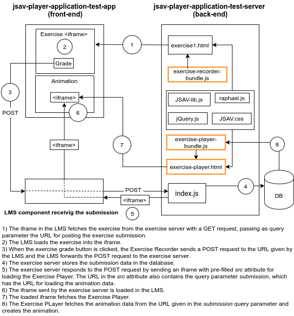

# JSAV-Palyer-Application-server

The server works as exercise service for our test LMS ([test application front-end](https://github.com/MarianiGiacomo/jsav-player-application-test-app)). Its duties are:
1. Serve the JSAV Visual Algorithm Simulation exercises with the [Exercise Recorder](https://github.com/MarianiGiacomo/jsav-exercise-recorder) embedded in them and all necessary libraries.
2. Server the [Exercise Player](https://github.com/MarianiGiacomo/jsav-exercise-player).
3. Handle exercises submissions `POST` requests:
  1. Receive the exercises submissions POST requests, which include the data recorded by the [Exercise Recorder](https://github.com/MarianiGiacomo/jsav-exercise-recorder).
  2. Send the data to the database (the DB is not included in this repository).
  3. Respond to the POST request by sending an `<iframe>` as string that loads the [Exercise Player](https://github.com/MarianiGiacomo/jsav-exercise-player) and includes as URL parameter of the `src` attribute the URL for fetching the data recorded by the [Exercise Recorder](https://github.com/MarianiGiacomo/jsav-exercise-recorder):

    `"<iframe id="player" title="player" src="${server}/jsav-player/player.html?submission=${url}"</frame>"`
4. Serve the [Exercise Player](https://github.com/MarianiGiacomo/jsav-exercise-player).
5. Handle `GET` requests containing the `submission` URL parameter:
  1. Fetch the submission from the database according to the given submission id (in the URL parameter).
  2. Respond by sending the data retrieved from the database.

## Configurations
The files in the [`./public`](https://github.com/MarianiGiacomo/jsav-palyer-application-test-server/tree/master/public) folder and its subfolder can be directly accessed:

[`app.use(express.static('public'))`](https://github.com/MarianiGiacomo/jsav-palyer-application-test-server/blob/d5c4445d1a819b3b9aed6852822a16eb85a6726a/index.js#L35)

### Database URL
The server is written to work with a MongoDB database, so you will need to set up one of your own and then follow the instructions below on where to add the user username, password and collection that the server should use.

If you run the server locally, for example during development, the database URL (which includes username and password) should be defined in a file called `.dbConf.js` under [`./db/`](https://github.com/MarianiGiacomo/jsav-palyer-application-test-server/tree/master/db). An example of `.dbConf.js` file is shown in `/db/.dbConf-sample.js`(https://github.com/MarianiGiacomo/jsav-palyer-application-test-server/blob/master/db/.dbConf-sample.js).

When you deploy your server, the database URI should instead be given as `DATABASE_URL` environment variable.

In [`./db/db.js`](https://github.com/MarianiGiacomo/jsav-palyer-application-test-server/blob/master/db/db.js) you might want to redefine the collection name where the received data will be save. Currently `DBCOLLECTION` is set to `submissions`.

## Starting the Server
- For development: `npm run dev`. Will reload each time you save a change.
- `npm start`.

